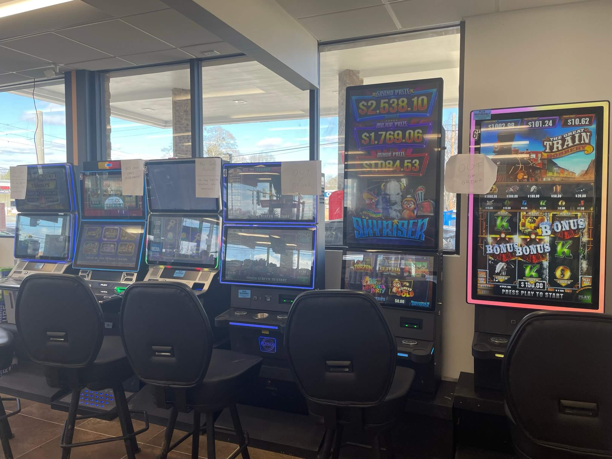

# 03 Market Considerations

Designing COAM games requires a different mindset and considerations than traditional Class 2 and Class 3 slot games.

## 03.01 Key Differences from Casinos

- Casinos are destinations, located in and adjacent to resorts, fine dining, and hotels; players travel specifically to visit them and play their games. COAM games are located in gas stations and restaurants, often in back rooms and dark corners.
- The average COAM player—inasmuch as such a thing exists—is markedly different from the average casino player:
  - Many are only seeking a momentary diversion, a chance to blow off a little steam, and a chance to pocket a little something extra; many do not specifically set out to play
  - They tend to be younger, are largely working class, and are more likely to be male when compared to casino players
  - Many speak English as a second language; some do not speak English at all
- Sound is a big part of the casino experience, but in gas stations and other retail establishments, constant loud music and sounds are not generally welcome
  - We can't assume that the sound will be turned up, let alone turned on
  - If there is no way to mute the sound in a game, many locations will simply unplug the speakers
- Because of where COAM games are located, there are specific complicating factors to take into account when designing COAM games and cabinets
  - Screens can be difficult to easily see through the glare from overhead lights, and may be washed out by outside light, depending on how the location is set up
  - Maintenance of the machines is the responsibility of the MLH, who may not be available immediately if there is a problem
  - These locations are unlikely to have any sort of security on-premises
  - The space is often limited, with low ceilings and cramped seating

This image—of a fairly average recent COAM installation—illustrates several of these points.

## 03.02 What Attracts and Sustains COAM Players

In our experience and observation, these factors can make the difference between a success and a failure. Note that these are generalities and prone to change over time and even from location to location.

- **Progressive Jackpots**: COAM players chase Progressives just like casino players. 
  - Game packs with shared Progressives should feature them prominently on the game select screen
  - Games with individual Progressives should show them on the game select screen as well, if possible
  - Persistent and Metamorphic features can create a similar anticipatory feeling and should be highlighted as well
- **Simplicity**: COAM games, especially their Skill Tests, need to be quick and easy to grasp. Most COAM games also have their pay tables displayed on the screen at all times. Players are accustomed to being able to size up a game at a glance
- **Familiarity & Innovation**: Many COAM players can be reluctant to try games with unfamiliar Skill Tests. At the same time, some players do seek out the new and different. The best approach is to mix the innovative and the tried-and-true in each Game Pack
- **"Fair" math**: Since they tend to play more often, and for shorter periods of time compared to casino players, finding the right math for COAM players can be a challenge.
  - Wins that pay less than your bet are frustrating
  - Too many small wins can become grating—recall that the Skill Test isn't really a feature, but a chore
  - Too few wins is, of course, a problem if the reward for their patience comes too late
